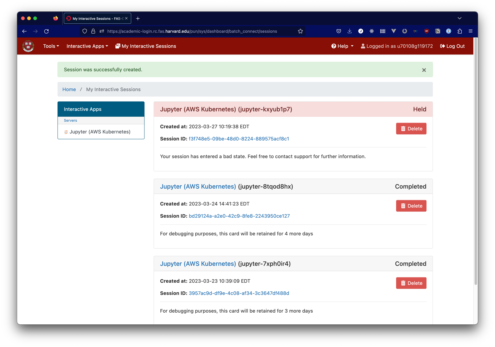

# OnDemand with Kubernetes (beta)

Some applications require the use of compute resources that cannot be provided by the FASRC Academic Cluster. For these applications, we have implemented a solution that uses Kubernetes to provide AWS resources to applications in FAS OnDemand. The primary use case for this approach is to provide GPU resources to courses.

OnDemand with Kubernetes is in a closed beta, and we are not currently making the platform available to new courses. If you are interested in using the platform, please contact [OnDemand@fas.harvard.edu](mailto:OnDemand@fas.harvard.edu?subject=Interest in OnDemand with Kubernetes) to discuss using the platform in future terms.

## Starting a Session

When starting a new session of a Kubernetes-backed application, you will launch it just like any other OnDemand application. However, it will launch in a held state, producing a message that looks like this:

This initial state is normal while the Kubernetes cluster allocates compute resources for your session. After a startup time of about 4 minutes, you should see this info card change to indicate that your session is starting, and then that it is ready for use.

If your session takes more than 10 minutes to start, that indicates a problem with your session is preventing it from starting. Please reach out to [OnDemand@fas.harvard.edu](mailto:OnDemand@fas.harvard.edu?subject=FAS OnDemand support), including information described in the "Reporting problems" section below

## Starting a Jupyter Notebook

The first time that you launch a Jupyter Notebook, the notebook will not be able to connect to the Python kernel for about 45 seconds. You may get an error message from Jupyter about being unable to connect to the kernel. This is normal as the kernel becomes available in the Kubernetes pod, and you should be able to run your Jupyter session as normal after about a minute. Other notebooks that you launch later in the same session should connect to the kernel without a delay.

## Reporting Problems

As this platform is in a beta test phase, there may be issues with the platform. If you use the platform and encounter errors outside of normal coding errors, we'd like to know about them to be able to improve the platform. 

When you report errors with the new platform, it helps to get your OnDemand user ID and the login node with the OnDemand platform that was in use when the error occurred. This information can be found on the OnDemand dashboard, as illustrated below:

In addition, if an error is encountered consistently in executing a particular piece of code, it would be helpful to have a sample of the notebook where the error occurs. If that notebook can be saved with the error output intact, that would be ideal.

Please contact [OnDemand@fas.harvard.edu](mailto:OnDemand@fas.harvard.edu?subject=FAS OnDemand support) with as much information as you are able to provide to report issues with the platform.