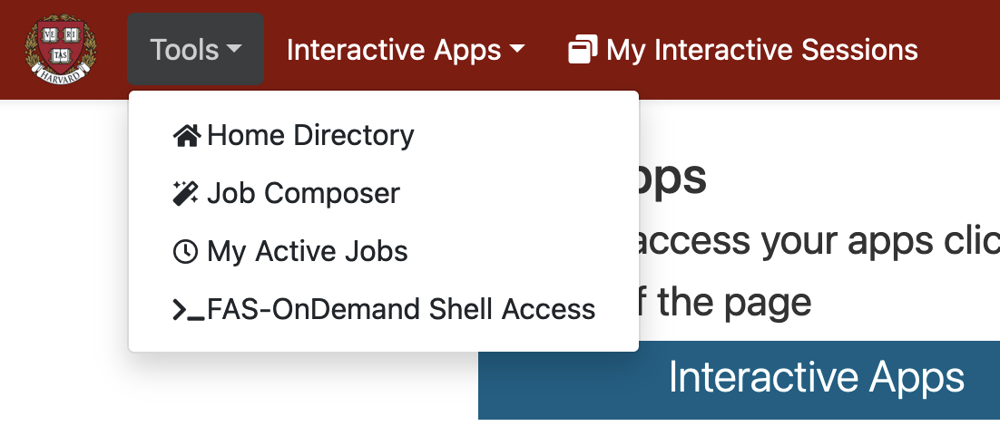
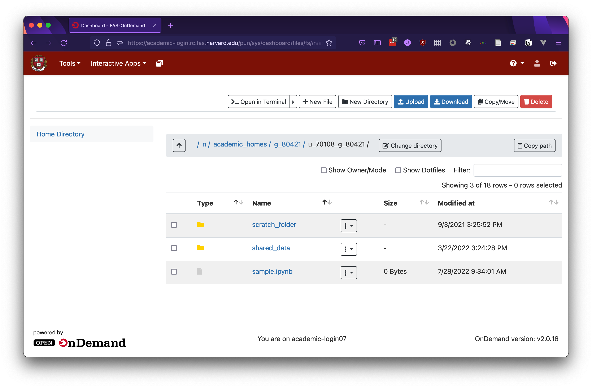

# Storage

When connecting to RStudio or to Jupyter Notebooks, there will be two storage folders available to you by default: **scratch_folder** and **shared_data**. You can also store data in your home directory, outside of these folders. Each of these storage locations works a bit differently, so here's an overview to help you decide which storage option to use at any given time.

## Tool-independent storage access

If you need to access or manipulate files in OnDemand, but don't need the tools of any of the programming environments, you can use the "Home Directory" tool in OnDemand. You can find it in the top right corner of the initial OnDemand home screen, as pictured below. In this example, you can see the shared folder, the scratch folder, and "sample.ipynb", which is outside of those folders in the example user's home folder.

## Home directory

Outside of the **scratch_folder** and **shared_data** folders, you can create your own folders and save your own files. Data stored outside of these folders is associated with your OnDemand user account, so it's persistent and tied to your account, but limited in size. By default, there's 20GB allocated to this directory per user, although instructors can request increased storage allocation where needed. Your home folder is also not symlinked, which can be important for some applications.

## Shared folder

The shared folder is accessible to everyone in a course with OnDemand installed. By default, the folder is read-only to students, so that only instructors and TFs can write to it. Instructors and TFs can create subfolders in that shared folder with more permissive settings, allowing students to write to certain shared folders when appropriate. These permissions can be updated through the OnDemand termminal app using normal unix file permission commands `chmod` and `chown`. If you'd like assistance adjusting folder permissions, please write to [atg@fas.harvard.edu](mailto:atg@fas.harvard.edu) or [fasondemand@rc.fas.harvard.edu](mailto:fasondemand@rc.fas.harvard.edu).

## Scratch folder

The scratch folder provides high-capacity storage symlinked to your home directory. 
The storage capacity for both scratch and shared folders is shared at the course level, and is larger than most courses will use (10TB). Scratch folders are unique for each OnDemand account, so while the storage capacity is shared, the folder contents are not. This storage is suitable for large files, but if an entire class will be using very large, unique datasets that may run into the storage limit, please reach out to [atg@fas.harvard.edu](mailto:atg@fas.harvard.edu) or [fasondemand@rc.fas.harvard.edu](mailto:fasondemand@rc.fas.harvard.edu).
